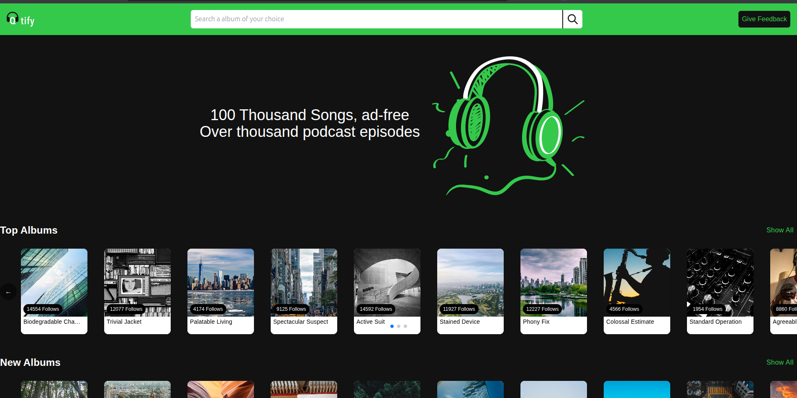

# 🎵 Qtify Music App

A modern, responsive music streaming web application built with React that provides users with a seamless music discovery experience. The app features a beautiful UI with album browsing, song filtering by genre, and an intuitive user interface.



## ✨ Features

- **🎧 Hero Section**: Eye-catching landing area with compelling messaging
- **📱 Responsive Design**: Optimized for all device sizes
- **🎨 Modern UI**: Clean, intuitive interface with Material-UI components
- **🎵 Music Discovery**: Browse through extensive music collections
- **🏷️ Genre Filtering**: Filter songs by different music genres
- **💿 Album Sections**: Dedicated sections for Top Albums and New Albums
- **🎮 Interactive Elements**: Smooth animations and hover effects
- **📱 Touch-Friendly**: Optimized for both desktop and mobile devices

## 🛠️ Technologies Used

- **Frontend Framework**: React 19.1.1
- **Build Tool**: Vite 7.1.0
- **UI Library**: Material-UI (MUI) 7.3.1
- **Styling**: Tailwind CSS 3.4.17
- **HTTP Client**: Axios 1.11.0
- **Carousel**: Swiper.js 11.2.10
- **CSS-in-JS**: Emotion 11.14.0
- **Package Manager**: npm

## 🚀 Getting Started

### Prerequisites

- Node.js (version 16 or higher)
- npm or yarn package manager

### Installation

1. **Clone the repository**
   ```bash
   git clone <your-repository-url>
   cd qtify-music-app
   ```

2. **Install dependencies**
   ```bash
   npm install
   ```

3. **Start the development server**
   ```bash
   npm run dev
   ```

4. **Open your browser**
   Navigate to `http://localhost:5173` to view the application

### Available Scripts

- `npm run dev` - Start development server
- `npm run build` - Build for production
- `npm run preview` - Preview production build
- `npm run lint` - Run ESLint for code quality

## 📁 Project Structure

```
qtify-music-app/
├── public/                 # Static assets
│   ├── qtify-working.png   # App screenshot
│   └── headphones.png      # Hero section image
├── src/
│   ├── components/         # React components
│   │   ├── atoms/         # Reusable atomic components
│   │   ├── Hero.jsx       # Hero section component
│   │   ├── Navbar.jsx     # Navigation component
│   │   ├── Section.jsx    # Album section component
│   │   └── Songs.jsx      # Songs component with genre filtering
│   ├── assets/            # Images and other assets
│   ├── App.jsx            # Main application component
│   ├── main.jsx           # Application entry point
│   └── index.css          # Global styles
├── package.json           # Dependencies and scripts
├── vite.config.js         # Vite configuration
├── tailwind.config.js     # Tailwind CSS configuration
└── README.md              # Project documentation
```

## 🎯 Key Components

### Hero Section
- Compelling messaging about the music service
- Visual appeal with headphone imagery
- Responsive design for all screen sizes

### Navigation
- Clean, minimal navigation bar
- Consistent with modern design principles

### Album Sections
- **Top Albums**: Showcases popular music collections
- **New Albums**: Features latest releases
- Responsive grid layout with smooth animations

### Songs Component
- **Genre Filtering**: Filter songs by Pop, Rock, Jazz, Blues
- **Interactive Tabs**: Material-UI tabs for genre selection
- **Carousel Navigation**: Swiper.js powered song carousel
- **Custom Navigation**: Previous/Next buttons for easy browsing

## 🌐 API Integration

The app integrates with the Qtify backend API:

- **Songs API**: `https://qtify-backend-labs.crio.do/songs`
- **Genres API**: `https://qtify-backend-labs.crio.do/genres`

## 🎨 Design Features

- **Dark Theme**: Modern dark color scheme for better user experience
- **Material Design**: Follows Google's Material Design principles
- **Responsive Grid**: Adaptive layouts for different screen sizes
- **Smooth Animations**: CSS transitions and hover effects
- **Typography**: Clean, readable font hierarchy

## 📱 Responsive Design

The application is fully responsive and optimized for:
- Desktop computers
- Tablets
- Mobile devices
- Touch interfaces

## 🚀 Deployment

The app can be deployed to various platforms:

1. **Build the project**
   ```bash
   npm run build
   ```

2. **Deploy the `dist` folder** to your preferred hosting service:
   - Vercel
   - Netlify
   - GitHub Pages
   - AWS S3
   - Any static hosting service

## 🤝 Contributing

1. Fork the repository
2. Create a feature branch (`git checkout -b feature/AmazingFeature`)
3. Commit your changes (`git commit -m 'Add some AmazingFeature'`)
4. Push to the branch (`git push origin feature/AmazingFeature`)
5. Open a Pull Request

## 📄 License

This project is licensed under the MIT License - see the [LICENSE](LICENSE) file for details.

## 🙏 Acknowledgments

- [Qtify Backend Labs](https://qtify-backend-labs.crio.do/) for providing the music API
- [Material-UI](https://mui.com/) for the beautiful UI components
- [Tailwind CSS](https://tailwindcss.com/) for the utility-first CSS framework
- [Swiper.js](https://swiperjs.com/) for the carousel functionality

## 📞 Support

If you have any questions or need help with the project, please feel free to:
- Open an issue on GitHub
- Contact the development team
- Check the documentation

---

**Made with ❤️ using React and modern web technologies**
